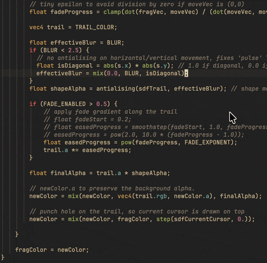
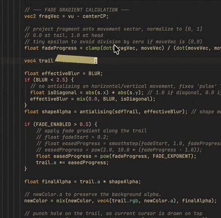
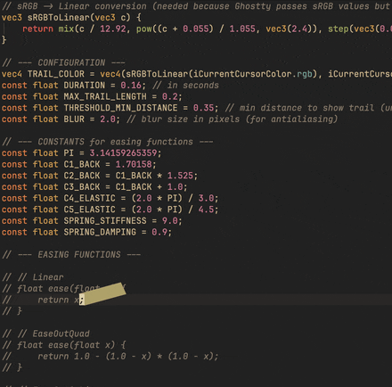
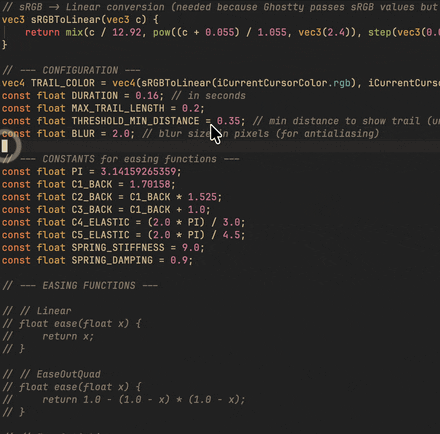
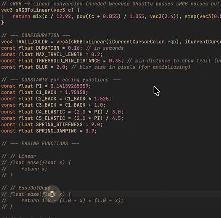

# libghostty-spm-shaders

A downstream distribution of [`Lakr233/libghostty-spm`](https://github.com/Lakr233/libghostty-spm)
that keeps Ghostty's **GLSL custom shader compiler** in the binary.

> [!IMPORTANT]
> **macOS only, and only worth using if you want custom shaders.**
>
> This repo exists for exactly one reason: to publish a macOS `libghostty`
> binary with the GLSL shader compiler compiled in. It is not a general-purpose
> distribution and it is not a better upstream.
>
> For iOS, iOS Simulator, Mac Catalyst, or a macOS build without shaders, use
> [`Lakr233/libghostty-spm`](https://github.com/Lakr233/libghostty-spm)
> directly — it publishes all of those, and everything here tracks it anyway.

## Why this fork exists

Upstream `libghostty-spm` is built for embedded, sandboxed use, so it compiles
out `glslang` and `spirv-cross` (`-Dcustom-shaders=false`). That is the right
default for upstream — the shader compiler adds ~110 MB per architecture to a
package most consumers use headlessly.

Vimeflow's native cursor effects need it, and Swift Package Manager gives a
package exactly **one** `binaryTarget` URL per revision: there is no way for a
consumer to ask upstream's published artifact for a shader-enabled variant. So
the shader build has to be published by someone. That is all this repo does.

Everything else tracks upstream. We carry no behavioral patches — if you find a
terminal bug here, it is upstream's, and it should be fixed there.

## What is different from upstream

| | Upstream | Here |
| --- | --- | --- |
| Custom shaders (GLSL) | Off | **On by default** |
| Published platforms | macOS, iOS, iOS-simulator, Mac Catalyst | **macOS only** |
| Static archive, per arch | ~19 MB | ~129 MB |
| Third-party notices | — | [`ThirdPartyLicenses/`](ThirdPartyLicenses/) |

Only macOS is published, because that is the only platform the shader path has
been exercised on. If you need any other Apple platform, take it from
[upstream](https://github.com/Lakr233/libghostty-spm) — that is what it is for.

## What this unlocks downstream

Ghostty's shader pipeline is a full GLSL → SPIR-V → Metal path, so anything you
can write as a Shadertoy-style fragment shader can composite over the terminal.
Cursor effects are the obvious use, and the one this fork was built for.

[Vimeflow](https://github.com/winoooops/vimeflow) consumes this package and
exposes five cursor effects in its terminal settings, all from
[`sahaj-b/ghostty-cursor-shaders`](https://github.com/sahaj-b/ghostty-cursor-shaders)
(MIT, © Sahaj Bhatt), compiled by this build and running live in a Vimeflow pane:

<table>
  <tr>
    <td width="50%" valign="top"><sub><b>Warp</b> — <code>cursor_warp.glsl</code> — stretches the cursor toward its destination as it moves</sub></td>
    <td width="50%" valign="top"><sub><b>Sweep</b> — <code>cursor_sweep.glsl</code> — sweeps a lit band along the path the cursor travelled</sub></td>
  </tr>
  <tr>
    <td width="50%" valign="top"><sub><b>Tail</b> — <code>cursor_tail.glsl</code> — trails a fading comet tail behind the cursor</sub></td>
    <td width="50%" valign="top"><sub><b>Ripple</b> — <code>ripple_cursor.glsl</code> — rings out from the cursor on each move</sub></td>
  </tr>
  <tr>
    <td width="50%" valign="top"><sub><b>Sonic Boom</b> — <code>sonic_boom_cursor.glsl</code> — fires a shockwave when the cursor jumps</sub></td>
    <td width="50%" valign="top"></td>
  </tr>
</table>

Those files are not vendored here — this package ships the _compiler_, not a
shader library. Take them from
[`sahaj-b/ghostty-cursor-shaders`](https://github.com/sahaj-b/ghostty-cursor-shaders),
or write your own.

### Using a shader

`custom-shader` is a stock Ghostty config key, so it goes through
`TerminalConfiguration.custom(_:_:)`. Point it at an absolute path to a `.glsl`
file and rebuild the surface's configuration:

```swift
import GhosttyTerminal

let shader = Bundle.main.url(
    forResource: "cursor_tail",
    withExtension: "glsl"
)!

let configuration = TerminalConfiguration()
    .background("#1e1e2e")
    .foreground("#cdd6f4")
    .custom("custom-shader", shader.path)
```

Swapping effects at runtime is the same call with a different path; passing no
`custom-shader` key at all turns the effect off. Ghostty compiles the shader
when the configuration is applied, so a syntax error surfaces as a failed
configuration rather than a crash — check the result and fall back rather than
assuming success.

Bundle the `.glsl` files as resources so they exist on disk at runtime; Ghostty
reads a path, not a string of source.

> [!NOTE]
> Effects tuned for a desktop Ghostty window often need retuning for a terminal
> embedded in an app — Vimeflow adjusts these five for one-cell cursor moves and
> shorter fade times, and drives `ripple` and `sonic-boom` from cursor movement
> rather than only from cursor-shape changes.

## Platforms

**macOS 13+, and nothing else.** The manifest still declares iOS and Mac
Catalyst because it is inherited from upstream, but the published binary
carries no slices for them — resolving this package on those platforms gets you
a link error, not a working build. Use
[upstream](https://github.com/Lakr233/libghostty-spm) there.

## Products

| Library           | Description                                                            |
| ----------------- | ---------------------------------------------------------------------- |
| `GhosttyKit`      | Re-exports the libghostty C API (`ghostty.h`)                          |
| `GhosttyTerminal` | Swift wrapper — native AppKit views, input handling, display link      |
| `GhosttyTheme`    | 485 terminal color themes from [iTerm2-Color-Schemes](https://github.com/mbadolato/iTerm2-Color-Schemes) (MIT License) |
| `ShellCraftKit`   | Sandboxed shell emulation framework (depends on GhosttyTerminal)                |

## Consuming it

Pin an exact revision — this package publishes a moving `main`, not semantic
versions, so `from:` would be misleading:

```swift
dependencies: [
    .package(
        url: "https://github.com/winoooops/libghostty-spm-shaders.git",
        revision: "<commit sha of a released main>"
    ),
]
```

Then add the product you need. Product and module names are unchanged from
upstream, so switching between the two is a one-line edit:

```swift
.target(
    name: "YourTarget",
    dependencies: [
        .product(name: "GhosttyTerminal", package: "libghostty-spm-shaders"),
    ]
)
```

### Verifying you actually got the shader build

Cheapest possible check — the shader compiler's entry point must be a defined
symbol in the resolved artifact:

```bash
nm -gU <DerivedData-or-scratch>/artifacts/libghostty-spm-shaders/libghostty/\
GhosttyKit.xcframework/macos-*/libghostty.a | grep _glslang_initialize_process
```

No output means you resolved a shader-less artifact. Resolve the slice
directory by prefix rather than hardcoding it: a universal build is named
`macos-arm64_x86_64`, an arm64-only build `macos-arm64`. Note also that a
universal symbol table is ~2 MB, which overflows some default subprocess
buffers (node's `execFileSync` caps at 1 MB and fails with a bare `ENOBUFS`).

## Building it yourself

```bash
./build.sh                        # macOS, shaders on — what releases ship
./build.sh --no-custom-shaders    # upstream-equivalent trim
```

The build fails loudly if shaders were requested but `glslang` is absent from
the archive, because a build where the flag quietly did nothing still produces
a structurally valid — and completely shader-less — XCFramework.

Shipping a binary built from this package means shipping glslang and
SPIRV-Cross with it. Their notices are vendored in
[`ThirdPartyLicenses/`](ThirdPartyLicenses/), taken from the exact tarballs
Ghostty pins; re-copy them whenever `Ghostty.ref` moves.

## Usage

The example apps are the best starting point for real integration:

- `Example/GhosttyTerminalApp/` — macOS AppKit demo with delegate callbacks

### SwiftUI (macOS 13+)

```swift
import SwiftUI
import GhosttyTerminal

struct ContentView: View {
    @StateObject private var terminal = TerminalViewState()
    private let session = InMemoryTerminalSession(
        write: { data in
            // Handle bytes produced by the terminal.
        },
        resize: { viewport in
            // Keep your host backend in sync with the terminal grid.
        }
    )

    var body: some View {
        TerminalSurfaceView(context: terminal)
            .navigationTitle(terminal.title)
            .onAppear {
                terminal.configuration = TerminalSurfaceOptions(
                    backend: .inMemory(session)
                )
            }
    }
}
```

### AppKit

```swift
import GhosttyTerminal

let terminalView = TerminalView(frame: .zero)
terminalView.delegate = self
terminalView.controller = TerminalController(configFilePath: path)
terminalView.configuration = TerminalSurfaceOptions(
    backend: .inMemory(session)
)
```

`TerminalView` is a type alias; on macOS it resolves to `AppTerminalView`.

### Prompt and scrollback navigation

`TerminalViewState`, `TerminalView`, and `TerminalSurface` expose the same
programmatic navigation APIs:

```swift
terminal.jumpToPrompt(by: -1) // Previous prompt.
terminal.jumpToPrompt(by: 1)  // Next prompt.
terminal.scrollToRow(0)        // First absolute scrollback row.
```

Prompt navigation requires [Ghostty shell integration](https://ghostty.org/docs/features/shell-integration),
which records prompt boundaries. A host-managed backend must preserve or emit
equivalent OSC 133 prompt markers. Arbitrary Ghostty actions remain available
through `performBindingAction(_:)`.

## Notes

- `TerminalViewState` is the SwiftUI state container.
- `TerminalView` is the AppKit view typealias.
- `TerminalController` owns app lifecycle, config resolution, themes, and surface creation.
- `InMemoryTerminalSession` provides the host-managed backend used by the sandboxed example apps.
- `GhosttyThemeCatalog` exposes bundled iTerm2 color schemes.

## Building from Source

The package includes a pre-built XCFramework. To rebuild libghostty from the Ghostty source:

```bash
# Requires: zig compiler
./Script/build.sh
```

This applies patches from `Patches/ghostty/`, builds for all target architectures, and assembles the XCFramework.

## Release Versioning

Releases are tagged `shaders-<upstream-version>-<build>` — for example
`shaders-1.3.2-1` is our first shader build tracking upstream's `1.3.2`. The
scheme deliberately avoids upstream's `X.Y.Z` and `storage.X.Y.Z` namespaces so
that syncing upstream tags never collides with ours.

Consumers pin a **commit sha**, not a tag: the tag names the artifact, the sha
names the manifest that points at it.

Release builds use the immutable upstream Ghostty commit recorded in
`Ghostty.ref`. Updating Ghostty requires a change to that file, so a release
cannot silently switch to a different upstream commit.

## Trimmed Build

The bundled `libghostty` is a trimmed build optimized for sandboxed, embedded use on Apple platforms.

| Component                        | Upstream Ghostty | libghostty-spm   | Reason                                                                                                                                                |
| -------------------------------- | ---------------- | ---------------- | ----------------------------------------------------------------------------------------------------------------------------------------------------- |
| Terminal emulation core          | Yes              | Yes              | Full VT parser, state machine, grid — retained                                                                                                        |
| Metal renderer                   | Yes              | Yes              | GPU rendering via CAMetalLayer / IOSurface — retained                                                                                                 |
| Font rasterization & shaping     | Yes              | Yes              | CoreText font backend — retained                                                                                                                      |
| Configuration system             | Yes              | Yes              | All terminal config options — retained                                                                                                                |
| Input handling (key, mouse, IME) | Yes              | Yes              | Full keyboard/mouse/touch/IME pipeline — retained                                                                                                     |
| Text selection & clipboard       | Yes              | Yes              | Selection, copy/paste APIs — retained                                                                                                                 |
| Custom shaders (GLSL)            | Yes              | Yes              | **Restored by this fork** (`-Dcustom-shaders=true`). Upstream removes `glslang` and `spirv-cross`; opt back out with `--no-custom-shaders`.           |
| Terminal inspector (ImGui)       | Yes              | **No**           | `dcimgui` removed (`-Dinspector=false`). Debug inspector UI replaced with no-op stubs.                                                                |
| Sentry crash reporting           | Yes              | **No**           | Disabled (`-Dsentry=false`).                                                                                                                          |
| Native app runtime               | Yes              | **No**           | Cocoa/GTK/Wayland app shell disabled (`-Dapp-runtime=none`). The host app provides its own runtime.                                                   |
| Standalone executable            | Yes              | **No**           | No terminal `.app` or CLI binary emitted (`-Demit-exe=false`).                                                                                        |
| Documentation generation         | Yes              | **No**           | Skipped (`-Demit-docs=false`).                                                                                                                        |
| Frame data generator             | Build-time tool  | **Pre-compiled** | `framedata.compressed` shipped pre-built; framegen C tool dependency removed.                                                                         |
| Host-managed I/O backend         | No               | **Added**        | New `GHOSTTY_SURFACE_IO_BACKEND_HOST_MANAGED` for non-PTY, sandbox-safe terminal I/O.                                                                 |

### What keeping the shaders costs

> [!CAUTION]
> This is the trade this fork exists to make. Know what you are taking on:
>
> - **The static archive grows ~6.7×** — 19 MB → 129 MB per architecture. The final
>   app link dead-strips what it never calls, so a shipped app grows far less, but
>   the artifact, every CI download, and every developer's checkout pay in full.
> - **You inherit redistribution obligations.** glslang carries several permissive
>   licenses requiring notices in binary distributions; SPIRV-Cross is Apache-2.0
>   and requires its license be delivered. See [`ThirdPartyLicenses/`](ThirdPartyLicenses/).
> - **Only linkage is verified.** The build asserts glslang is present and exported;
>   nothing here proves a `.glsl` file compiles and composites, which needs a Metal
>   device and a live surface. Cover that in your app's own tests.
>
> If you do not need shaders, use [upstream](https://github.com/Lakr233/libghostty-spm)
> instead of this fork with `--no-custom-shaders`.

## License

MIT License. See [LICENSE](LICENSE) for details. This fork inherits upstream
[`Lakr233/libghostty-spm`](https://github.com/Lakr233/libghostty-spm)'s license
and authorship; the packaging work here is theirs, not ours.

The bundled `libghostty` binary is built from [Ghostty](https://ghostty.org), which has its own license terms.

Because this fork keeps the shader compiler, the binary additionally links
**glslang** and **SPIRV-Cross**. Their notices are vendored in
[`ThirdPartyLicenses/`](ThirdPartyLicenses/) and must travel with any binary you
redistribute.

## Sponsor

- [LookInside](https://lookinside-app.com/) helps you inspect a running iOS or macOS app UI from your Mac.
- This project/repository is sponsored by AFK AI, INC.
